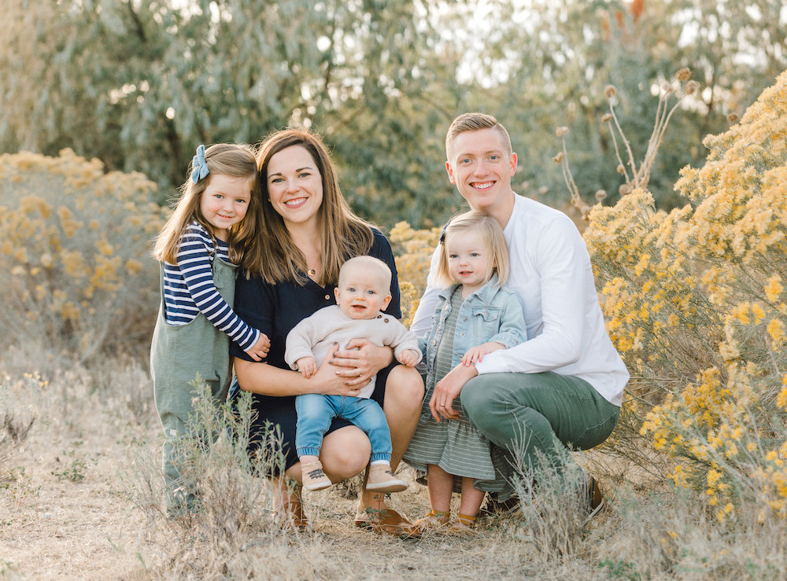

I'm a family man at heart. I have a beautiful wife and three wonderful kids
(Ellie, Charlie, and Fox) with number four expected later this year. I enjoy
spending every moment I can with my family. Together we enjoy camping, kayaking,
gardening, watching movies, and eating pizza. When I'm not with my family or
working, I can usually be found playing piano, cycling, playing basketball, or
playing racquetball.
While my undergraduate degree is in Statistics and my graduate degree is in Data
Science, I consider myself more of a software professional than anything else.
I'm an avid R advocate, user, and developer. I work for
[RStudio](https://www.rstudio.com/) as a Solutions Engineer where I help
enterprises integrate RStudio products into their data environments. I also work
on R packages, write for the [RViews blog](https://rviews.rstudio.com/), and
work to create resources that will benefit the R community.